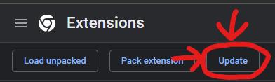
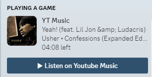
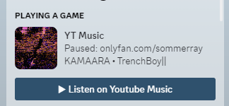

# Discord Rich Presence

This project is a Discord Rich Presence that displays information about the currently playing music on Discord.

## Features
| Features          | Status    |
| ----------------  | --------- |
| Song Name         | :white_check_mark: |
| Album Cover       | :white_check_mark: |
| Pausing/Unpausing | :white_check_mark: |
| Share Button      | :white_check_mark: |

## Installation

1. Clone the repository to your local machine.
2. Navigate to the project directory and install the required dependencies using npm:

```bash
npm install
```

3. Run the setup script (creates `.env`)
```bash
npm run setup
# OR
# ./setup.sh
```

4. Ensure you have a Discord application created and obtain the `client_id` for the RPC. Replace the value of `CLIENT_ID` in the `.env` file with your application's client ID.

5. Add the extension to your web browser (only Chromium based browsers are supported)

### Extension Installation:
1. Open your Chromium based browser and navigate to `chrome://extensions/`, or the respective extensions page, in the address bar.
2. Turn on the Developer Mode switch (usually located at the top-right corner of the extensions page).
3. Click on the "Load unpacked" button.
4. Browse to the project directory where you cloned the repository and select the folder containing the extension files.
The Discord Rich Presence extension should now be installed and active in your Chromium browser.


## Prerequisites

- Node.js and npm installed on your machine.

## Usage

1. Start the Express server to listen for incoming requests:

```bash
node index.js
```

2. Ensure that the Chrome extension is active.

## Updating

Updating your local version of the project is rather simple, and all you have to do is:

1. Navigate to where it is installed and update the Git repo
```bash
git pull
```

2. Update the required dependencies using npm:
```bash
npm install
```

3. Navigate to [Chrome's extension manager](chrome://extensions) (chrome://extensions) and press `Update`



## Notes

- The RPC Client will display the provided song information with a Discord Rich Presence (see images below).
- The server uses the Express framework to handle incoming POST requests.
- The `replaceHTMLEntities` function is used to sanitize strings and parse all HTML entities into their string form and removes all new lines before displaying them on Discord.
- The `update` function updates the Rich Presence status with the provided song information.
- The default image for the bot is 'ytm' (You can customize this in the code, or set your own in the `.env`).


## Images



