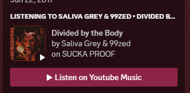
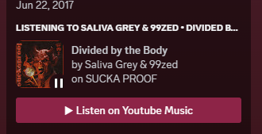

<div align="center">
    <h3 align="center">
        Youtube Music Discord Rich Presence
    </h3>
    <p align="center">
        A simplistic rich presence for <a href="https://discordapp.com">Discord</a> that displays your song information from Youtube Music.
    </p>
</div>

- - -

<details>
  <summary>Table of Contents</summary>
  <ol>
    <li><a href="#features">Features</a></li>
    <li>
      <a href="#getting-started">Getting Started</a>
      <ul>
        <li><a href="#prerequisites">Prerequisites</a></li>
        <li><a href="#installation">Installation</a></li>
      </ul>
    </li>
  </ol>
</details>

## Features
| Features                 | Status             |
| ------------------------ | ------------------ |
| Song Name                | :white_check_mark: |
| Album Cover              | :white_check_mark: |
| Share Button             | :white_check_mark: |
| Pausing/Unpausing        | :white_check_mark: |
| Pause/Playing mini-icons | :white_check_mark: |

## Getting Started

Depending whether or not you use a Discord client modification, the way the RPC will look is different.

* Without client modification (native RPC)


* With client modification (plugin)




### Prerequisites

* [Node.js (v18.17.1 LTS)](https://nodejs.org/en/download) alongside npm
* The Typescript Compiler
  ```sh
  # After installing Node.js
  npm install typescript -g
  ```
* Git
* A [Chromium](https://chromium.org) browser, or one that can run Chromium extensions
  *    <details>
        <summary>List of Chromium Browsers</summary>
        <ol>
            <li><a href="https://chromium.org">Chromium</a></li>
            <li><a href="https://google.com/chrome">Google Chrome</a></li>
            <li><a href="https://www.microsoft.com/en-us/edge">Microsoft Edge</a></li>
            <li><a href="https://brave.com">Brave</a></li>
            <li><a href="https://www.opera.com/gx">Opera GX</a> and <a href="https://www.opera.com">Opera</a></li>
        </ol>
        </details>


### Usage
In order to use this project, you must have the [server](#server-installation) running, alongside the 
[Chromium extension](#extension-installation) running.

To start and install each respective component in located within its section.

### Installation

> [!NOTE]
> This project has a setup script in order to streamline the installation process, the manual methods of
> installing and setting up the components are still available. 

Before proceeding with any of the methods below for installation, you have to clone the project.
Open your terminal, where you wish to store the files for the project, then run the following:
```sh
git clone https://github.com/acelikesghosts/ytm-rpc.git
cd ytm-rpc
```

Then proceed with one of the following:

* [Server Installation](#server-installation)
* [Extension Installation](#extension-installation)
* [Client Mod Installation](#client-mod-installation)

### Setup Script

To run the setup script, you must have a bash terminal.

The accepted arguments are the following:

**ALL OPTIONS ARE OPTIONAL, BUT ATLEAST ONE IS REQUIRED TO RUN THE SCRIPT**
| Argument                   | Description                                          |
| -------------------------- | ---------------------------------------------------- |
| `--deps`                   | Installs the dependencies required for each project. |
| `--build`                  | Builds the server                                    |
| `--client=<bd\|replugged>` | Specify what client modification to install          |

After deciding what arguments you wish to pass to the setup script, run the following:

```sh
bash ./scripts/setup.sh (your arguments)
```

The recommended installation script arguments are the following:
```sh
bash ./scripts/setup.sh --deps --build
```

### Server Installation
1. Install the NPM dependencies
   ```sh
   npm install
   ```
2. Copy the `.env.example` into `.env`
   ```sh
   cp .env.example .env
   ```
3. Configure the `.env` file 
   * If using a client mod it is required to set `USING_WS` to true
   * You can change the pause/play mini-icons, and more by doing so.
5. Build the server
   ```sh
   npx tsc
   ```

Then run it using `node .`

### Extension Installation

1. Open your Chromium based browser and navigate to the respective extensions tab.
2. Turn on the Developer Mode switch (typically located in the top right of the extensions page)
3. Click on the "Load Unpacked" button
4. BRowser to the project directory, and select the folder named `chrome-extension`

If you have any open tabs of Youtube Music, please restart them.

### Client Mod Installation

> [!WARNING]
> Using client modifications on Discord can result in termination, or account suspension.

| Client Mod                      | Status             |
| ------------------------------- | ------------------ |
| [BetterDiscord](#betterdiscord) | :white_check_mark: |
| [Replugged](#replugged)         | :white_check_mark: |
| [Vencord](#vencord)             | :x:                |


#### BetterDiscord

1. Navigate to the [client-mods/betterdiscord](./client-mods/BetterDiscord/) folder.
2. Open your BetterDiscord plugin folder.
3. Copy the `YTM.plugin.js` file into the plugins folder.
4. Enable the plugin within BetterDiscord

#### Replugged

**Prerequisites**
* pnpm
  ```sh
  npm i pnpm -g
  ```

If you have changed the port which the server runs at, change it within the plugin's settings as well.

1. Navigate to the [client-mods/replugged](./client-mods/replugged/) folder.
2. Install the dependenices for the project.
  ```sh
  pnpm install
  ```
3. Build the Typescript project
  ```sh
  pnpm run build
  ```
4. Ensure that it is in your Replugged plugins folder after building.
5. Navigate to the plugin settings within Replugged.
6. Press `Load Missing Buttons`, then refresh Discord.


### Vencord

At the moment, it is not possible to create custom plugins for Vencord without having it merged into the
base client mod, which is a big overstep for a project like this.

[Follow this PR for when they allow external plugins](https://github.com/Vendicated/Vencord/pull/951)

### Updating

Updating your local version of the project is rather simple, and all you have to do is:

1. Navigate to where it is installed and update the Git repo
```bash
git pull
```

2. Update the required dependencies using npm:
```bash
npm install
```

3. Rebuild the Typescript codebase
```bash
npm run ts:build
```

4. Navigate to [the browser's extension manager](#extension-installation) and press `Update`


5. If you are using a client modification, go to the respective installation section and proceed with the steps.