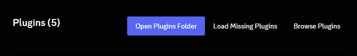

# Youtube Music Discord Rich Presence

This project is a Discord Rich Presence that displays information about the currently playing music on Discord.

## Features
| Features                 | Status             |
| ------------------------ | ------------------ |
| Song Name                | :white_check_mark: |
| Album Cover              | :white_check_mark: |
| Share Button             | :white_check_mark: |
| Pausing/Unpausing        | :white_check_mark: |
| Pause/Playing mini-icons | :white_check_mark: |

## Prerequisites

- Node.js and npm installed on your machine.
- Typescript compiler (`tsc`) installed on your machine.
- A [Chromium](https://www.chromium.org/Home/) based web-browser.

## Installation
At this moment, you can either manually install the the RPC, or run the setup script.
It is heavily recommended that you manually install the required parts, alongside manually set them up.

If you wish to use the setup script, after cloning the repository, run the following:

Unix
```sh
bash ./scripts/setup.sh --deps --build
```

## Server Installation

> [!IMPORTANT]  
> The default server installation will use an rich presence, which does not support `Listening to ...`, if you want
> that feature you are required to use a [client mod](#client-mod-installation). If you are using a client mod,
> set the `USING_WS` setting in your `.env` to `true`.

1. Clone the repository to your local machine.
2. Navigate to the project directory and install the required dependencies using npm:

```bash
npm install
```

3. Run the setup script (creates `.env`)
```bash
npm run setup
# OR
# ./setup.sh
```

4. Run the build script
```bash
npm run ts:build
# OR
# npx tsc ./src/
```

Optional:
- If you wish to use a custom image for the waiting for stage, or the play/pause icons, you will have to make your own Discord application and provide the images there.
- If the default port of `2134` is in use already, change the value in both the `.env`, and the [extension's background script](https://github.com/AceLikesGhosts/ytm-rpc/blob/master/chrome-extension/background.js#L23)

### Extension Installation:
1. Open your Chromium based browser and navigate to the respective extensions page (`chrome://extensions` for Google Chrome/Chromium, `opera://extensions` for Opera/OperaGX).
2. Turn on the Developer Mode switch (usually located at the top-right corner of the extensions page).
3. Click on the "Load unpacked" button.
4. Browse to the project directory where you cloned the repository and select the folder named `chrome-extension`.
The extension should now be installed and active in your Chromium browser.

## Client Mod Installation:

> [!WARNING]  
> Using a client mod is against [Discord's Terms of Service](https://dis.gd/tos), and can result in account termination.

Based off of your flavor of [Discord](https://discordapp.com) client mod, the plugin you will need to install
will vary with installation steps.

All client mod flavors still require both the server and the extension.

| Client Mod                                          | Status             |
| --------------------------------------------------- | ------------------ |
| [BetterDiscord](#betterdiscord-plugin-installation) | :white_check_mark: |
| [Replugged](#replugged-plugin-installation)         | :white_check_mark: |
| [Vencord](#vencord-plugin-installation)             | :x:                |

### BetterDiscord Plugin Installation

1. Navigate to the [client-mods/BetterDiscord](./client-mods/BetterDiscord/) folder.
2. Open your [BetterDiscord](https://betterdiscord.app) plugin folder.
3. Copy the `YTM.plugin.js` file into your BetterDiscord plugin folder.
4. Enable the plugin within BetterDiscord
5. (Optional) If you have modified the port of the server, change the port within the settings.

### Replugged Plugin Installation

1. Navigate to the [client-mods/replugged](./client-mods/replugged/) folder.
2. Install the required dependencies and build the source code.
    ```sh
    pnpm install
    pnpm run build
    ```
3. Ensure that it is in your [Replugged](https://replugged.dev) plugin folder after building, if it is not manually copy it into it.
4. Navigate to the plugin settings within Replugged
5. Press `load missing plugins`, then refresh Discord



### Vencord Plugin Installation

At this moment, [Vencord](https://vencord.dev) is not supported due to them not supporting external plugins; as this is a very niche 
thing, getting the plugin merged into the normal Vencord selection of plugins would be near impossible.

## Usage

1. Compile the Typescript codebase if you have not already
```bash
npm run ts:build
# OR
# npx tsc ./src/
```

2. Start the Express server to listen for incoming requests:

```bash
node .
```

3. Ensure that the Chrome extension is active.

## Updating

Updating your local version of the project is rather simple, and all you have to do is:

1. Navigate to where it is installed and update the Git repo
```bash
git pull
```

2. Update the required dependencies using npm:
```bash
npm install
```

3. Rebuild the Typescript codebase
```bash
npm run ts:build
# OR
# npx tsc ./src/
```

4. Navigate to [the browser's extension manager](#extension-installation) and press `Update`


## Notes

- If using the RPC strategy you will be limited to 1 change per every 15 seconds, alongside not getting the `Listening to` status.

## Images


#### RPC


---


#### Client Mod Plugins

> [!NOTE]
> These screenshots are taken with the [BetterDiscord](#betterdiscord-plugin-installation) plugin
> although it will look the same on any other client mod flavor.


